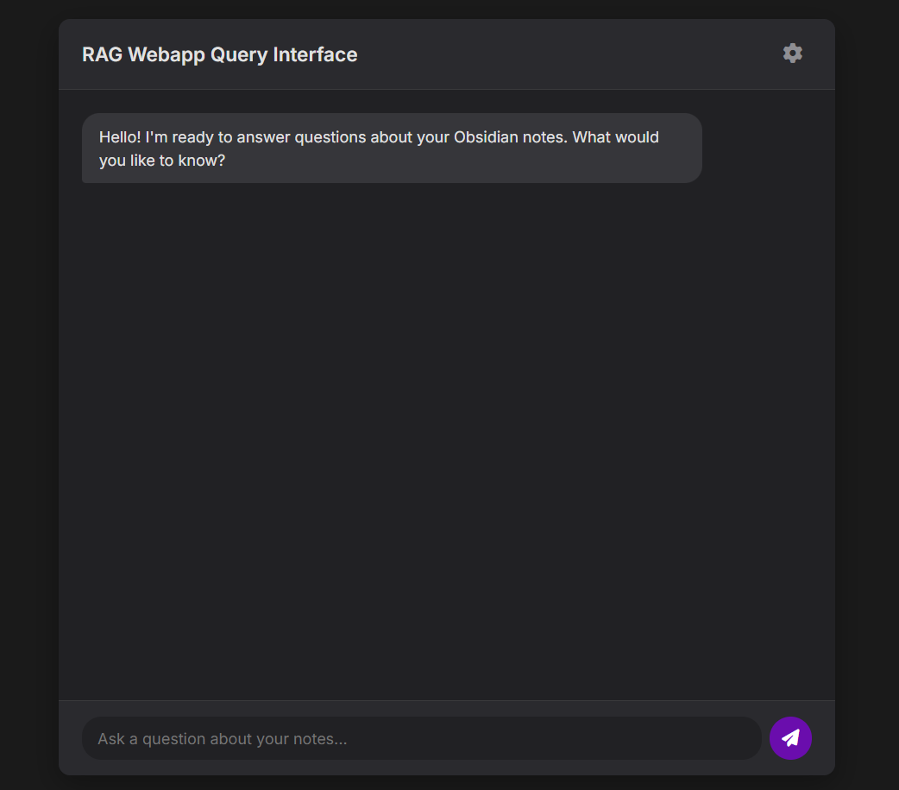

# Groq-Powered RAG Webapp for Obsidian Files

This project is a **web application** that enables users to query and interact with their Obsidian Markdown files using **Groq's LLM** for **retrieval-augmented generation (RAG)**. The app indexes Markdown files in a specified directory, generates embeddings for efficient text retrieval, and leverages Groq's powerful language model to provide context-aware responses to user queries.

---

## Features

1. **Markdown File Indexing**:
   - Reads all `.md` files from a specified directory.
   - Generates embeddings using `sentence-transformers` for text similarity and search.

2. **Retrieval-Augmented Querying**:
   - Retrieves and stitches the most relevant Markdown file contents based on user queries.
   - Sends the stitched context to Groq's LLM for response generation.

3. **Web-Based Query Interface**:
   - A clean and responsive web interface to submit queries and view responses.

4. **Real-Time Reindexing**:
   - Detects changes in the Markdown directory and re-indexes the files automatically.

---

## Prerequisites

### Install Python Libraries
Ensure you have Python 3.8+ installed. Install the required libraries using pip:

```bash
pip install fastapi[standard] pydantic transformers sentence-transformers numpy groq
```

### API Key
Obtain an API key from Groq and set it as an environment variable:

```bash
export GROQ_API_KEY="your_api_key_here"
```

---

## Running the Application

1. Clone the repository:

```bash
git clone https://github.com/iamAliAsgharKhan/Groq-Powered-RAG-Webapp-for-Obsidian-Files.git
cd Groq-Powered-RAG-Webapp-for-Obsidian-Files
```

2. Update the directory path:
   
   Modify the `MD_DIRECTORY` variable in `chat.py` to point to the folder containing your Obsidian `.md` files.

3. Start the FastAPI application:

```bash
uvicorn chat:app --reload
```
or use

```bash

fastapi dev chat.py
```

4. Access the web interface:
   
   Open [http://127.0.0.1:8000](http://127.0.0.1:8000) in your browser.

---

## How It Works

### File Indexing
- The application scans the `MD_DIRECTORY` for Markdown files.
- Computes embeddings using `sentence-transformers`.
- Saves file embeddings and hash states for efficient change detection.

### Query Processing
1. A user submits a query via the web interface.
2. The app retrieves the most relevant file content based on the query's similarity to embeddings.
3. The relevant context is stitched together and clipped to a token limit.
4. The query and context are sent to Groq's LLM, which generates a response.

### Key Components
- **`clip_text_to_tokens`**:
  Ensures text doesn't exceed a specified token count by leveraging the GPT-2 tokenizer.
- **`has_directory_changed`**:
  Detects changes in the Markdown directory and triggers reindexing.
- **`generate_response_from_groq`**:
  Sends the query and context to Groq's LLM API and returns the response.

---

## Endpoints

### `/query` (POST)
Submit a query to the application.

**Request Body:**
```json
{
  "query": "string",
  "max_tokens": "integer"
}
```

**Response:**
```json
{
  "query": "string",
  "response": "string"
}
```

### `/status` (GET)
Returns the API status and the number of indexed documents.

**Response:**
```json
{
  "status": "string",
  "documents_indexed": "integer"
}
```

### `/reindex` (POST)
Manually trigger reindexing of the Markdown directory.

**Response:**
```json
{
  "message": "string"
}
```

### `/` (GET)
Serves the web-based query interface.

---

## Example Workflow
1. Start the server.
2. Navigate to the homepage and enter a query in the input box.
3. Submit the query to receive a response based on your Markdown files.

---

## To-Do / Improvements
- Better interface with a chat-like flow; currently, it is simple request-and-response.
- Handle cases where the query has no relevant context files.
- Integrate web search for enhanced responses.
- Support image attachments through the web interface/frontend.
- Develop better techniques for dialogue interactions and maintaining conversation history for improved recommendations and user interaction.

---

## Screenshot


---

## Contribution
Feel free to submit issues and pull requests to improve the application. Contributions are welcome!

---

## License
This project is licensed under the MIT License. See `LICENSE` for details.

---

Enjoy querying your knowledge base with Groq and FastAPI!

