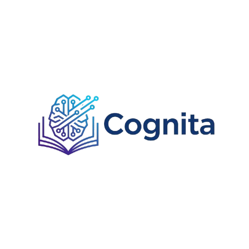

# Cognita

A sophisticated, conversational AI web application that allows you to chat with your local Obsidian notes. It uses Retrieval-Augmented Generation (RAG) to provide contextually-aware answers, backed by a persistent vector database and powered by the high-speed Groq LLM API.

The application features a modern chat interface, dynamic configuration for both the source of your notes and the AI embedding model, and even provides source citations for its answers.



---

## ✨ Key Features

-   **Conversational Chat Interface**: Interact with your knowledge base through an intuitive, chat-bubble UI, a huge upgrade from a simple request-response form.
-   **Persistent Vector Storage with Chroma DB**: Replaced fragile in-memory storage with Chroma DB, ensuring your document embeddings are saved, scalable, and load instantly on startup.
-   **Dynamic Embedding Model Selection**: Don't be locked into one model. The UI allows you to choose from multiple `sentence-transformer` models, with the backend dynamically loading them and storing embeddings in separate, model-specific collections.
-   **Configurable Source Directory**: Easily change the source directory of your Obsidian notes directly from the UI. The application intelligently clears old indexes to prevent data contamination.
-   **Source-Aware Responses (Citations)**: Build trust and explore your knowledge base. The AI now cites its sources, showing you exactly which of your notes were used to generate a response.
-   **Real-time Re-indexing via UI**: A dedicated "Re-index" button in the settings modal allows you to update the knowledge base for a specific model with a single click.
-   **Clean & Maintainable Frontend**: The UI code is professionally separated into `index.html`, `style.css`, and `script.js` for easy maintenance and future development.
-   **Clean Settings Modal**: Key settings like the source directory and model selection are managed in a clean, unobtrusive modal window that doesn't disrupt the main chat layout.

---

## 🛠️ Tech Stack

-   **Backend**: FastAPI
-   **LLM**: Groq (Llama3-70b)
-   **Vector Database**: Chroma DB
-   **Embedding Models**: Sentence Transformers
-   **Frontend**: HTML5, CSS3, Vanilla JavaScript
-   **API Key Management**: python-dotenv

---

## 🚀 Getting Started

### Prerequisites

1.  **Python 3.8+**
2.  **Groq API Key**: Obtain a free API key from [Groq](https://console.groq.com/keys).

### Installation

1.  **Clone the repository:**
    ```bash
    git clone https://github.com/iamAliAsgharKhan/Cognita.git
    cd Cognita
    ```

2.  **Install the required Python libraries:**
    *(It is recommended to use a virtual environment)*
    ```bash
    pip install "fastapi[all]" sentence-transformers groq chromadb python-dotenv transformers
    ```

3.  **Set up your environment variables:**
    Create a file named `.env` in the project's root directory. Copy the contents of `example.env` into it and add your Groq API key:
    ```.env
    GROQ_API_KEY="gsk_YourSecretKeyHere"
    ```

### Running the Application

1.  **Start the FastAPI server:**
    ```bash
    uvicorn chat:app --reload
    ```
    On the first run, the app will download the default embedding model and create a `my_chroma_db` directory for the vector database.

2.  **Access the web interface:**
    Open your browser and navigate to **[http://127.0.0.1:8000](http://127.0.0.1:8000)**.

---

## ⚙️ How It Works

1.  **Configuration**: The user clicks the settings icon to open a modal window where they can set their Obsidian notes directory and select an embedding model.
2.  **Indexing**: When the "Re-index" button is clicked, the application scans all `.md` files in the specified directory. It generates vector embeddings for each file using the chosen Sentence Transformer model and stores them in a dedicated Chroma DB collection named after the model.
3.  **Querying**:
    -   A user submits a query via the chat interface.
    -   The backend generates an embedding for the query using the *same model* that is currently selected.
    -   It queries the corresponding Chroma DB collection to find the most semantically similar notes.
    -   The content and metadata (source file paths) of these notes are retrieved.
    -   The note content is stitched together to form a rich context.
    -   This context, along with the original query, is sent to the Groq LLM API.
    -   The LLM's response and the list of source filenames are sent back to the UI and displayed.

---

## ↔️ API Endpoints

-   `GET /`: Serves the main HTML interface.
-   `POST /query`: Submits a query.
    -   **Request**: `{"query": "string", "model_name": "string"}`
    -   **Response**: `{"query": "string", "response": "string", "sources": ["file1.md", "file2.md"]}`
-   `POST /reindex`: Triggers a full re-index of the source directory.
    -   **Request**: `{"model_name": "string"}`
-   `GET /models`: Returns a list of available embedding models.
-   `GET /directory`: Returns the current notes directory path.
-   `POST /directory`: Sets a new notes directory path and clears all existing indexes.
-   `GET /status`: Returns the status and document count of all indexed collections.

---

## 🔮 Future Improvements

-   **Implement Streaming Responses**: Stream tokens from Groq as they are generated for a much faster perceived response time.
-   **Improve Document Chunking**: Split large files into smaller, more focused chunks before embedding to improve retrieval accuracy.
-   **Maintain Conversation History**: Allow for follow-up questions by sending the recent chat history to the LLM as additional context.

---

## 📜 License

This project is licensed under the MIT License. See `LICENSE` for details.